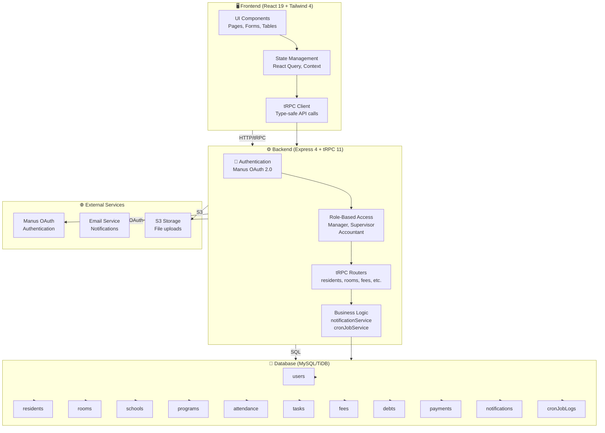
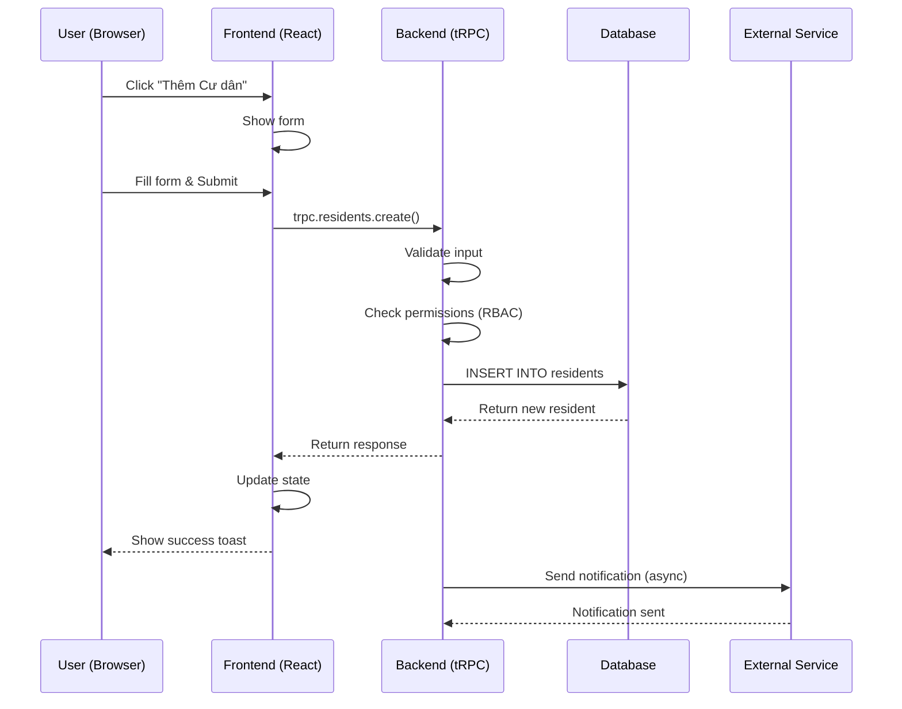
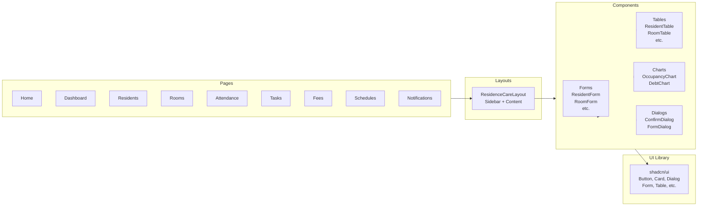
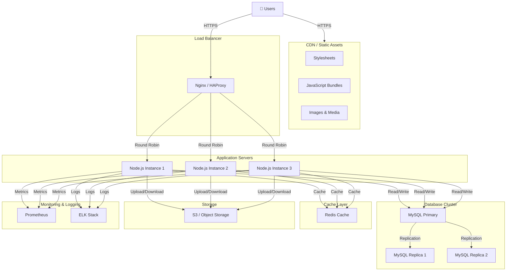
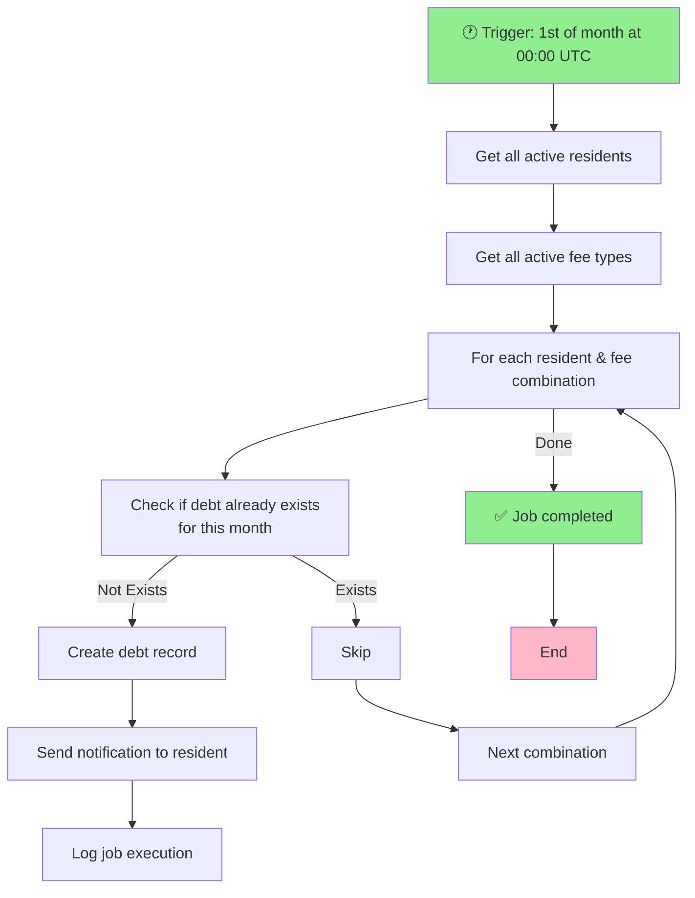
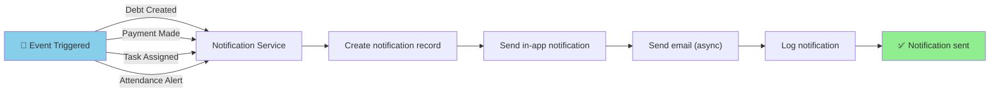
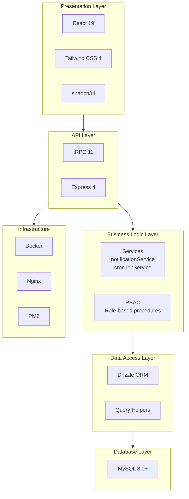

# Architecture Diagram - ResidenceCare

## System Architecture



---

## Data Flow Diagram



---

## Component Architecture



---

## Database Schema Diagram

```mermaid
erDiagram
    USERS ||--o{ RESIDENTS : creates
    USERS ||--o{ NOTIFICATIONS : receives
    USERS ||--o{ TASKASSIGNMENTS : "assigned to"
    
    SCHOOLS ||--o{ PROGRAMS : has
    SCHOOLS ||--o{ RESIDENTS : "has students"
    PROGRAMS ||--o{ RESIDENTS : "has students"
    
    ROOMS ||--o{ RESIDENTS : contains
    
    RESIDENTS ||--o{ ATTENDANCE : records
    RESIDENTS ||--o{ TASKASSIGNMENTS : "assigned to"
    RESIDENTS ||--o{ DEBTS : owes
    
    TASKASSIGNMENTS }o--|| TASKTYPES : "assigned type"
    
    DEBTS }o--|| FEETYPES : "is type of"
    DEBTS ||--o{ PAYMENTS : receives
    
    SCHEDULES ||--o{ ATTENDANCE : "follows"
    
    CRONLOGS ||--o{ DEBTS : "generates"

    USERS : int id PK
    USERS : string openId UK
    USERS : string name
    USERS : string email
    USERS : enum role

    RESIDENTS : int id PK
    RESIDENTS : string fullName
    RESIDENTS : string email
    RESIDENTS : int schoolId FK
    RESIDENTS : int programId FK
    RESIDENTS : int roomId FK
    RESIDENTS : enum status

    ROOMS : int id PK
    ROOMS : string roomNumber UK
    ROOMS : int capacity
    ROOMS : string description

    SCHOOLS : int id PK
    SCHOOLS : string name
    SCHOOLS : string city
    SCHOOLS : string address

    PROGRAMS : int id PK
    PROGRAMS : int schoolId FK
    PROGRAMS : string name
    PROGRAMS : string academicYear

    ATTENDANCE : int id PK
    ATTENDANCE : int residentId FK
    ATTENDANCE : date date
    ATTENDANCE : time checkInTime
    ATTENDANCE : time checkOutTime
    ATTENDANCE : enum status

    SCHEDULES : int id PK
    SCHEDULES : string name
    SCHEDULES : enum type
    SCHEDULES : time scheduledTime
    SCHEDULES : boolean isDaily

    TASKTYPES : int id PK
    TASKTYPES : string name
    TASKTYPES : string description

    TASKASSIGNMENTS : int id PK
    TASKASSIGNMENTS : int taskTypeId FK
    TASKASSIGNMENTS : int assignedTo FK
    TASKASSIGNMENTS : date dueDate
    TASKASSIGNMENTS : enum status

    FEETYPES : int id PK
    FEETYPES : string name
    FEETYPES : string code UK
    FEETYPES : decimal amount
    FEETYPES : enum billingCycle
    FEETYPES : boolean isActive

    DEBTS : int id PK
    DEBTS : int residentId FK
    DEBTS : int feeTypeId FK
    DEBTS : decimal amount
    DEBTS : string billingMonth
    DEBTS : date dueDate
    DEBTS : enum status

    PAYMENTS : int id PK
    PAYMENTS : int debtId FK
    PAYMENTS : decimal amount
    PAYMENTS : date paymentDate
    PAYMENTS : enum paymentMethod

    NOTIFICATIONS : int id PK
    NOTIFICATIONS : int recipientId FK
    NOTIFICATIONS : enum type
    NOTIFICATIONS : string title
    NOTIFICATIONS : string content
    NOTIFICATIONS : boolean isRead

    CRONLOGS : int id PK
    CRONLOGS : string jobName
    CRONLOGS : timestamp executionDate
    CRONLOGS : enum status
```

---

## Deployment Architecture



---

## Cron Job Flow



---

## Notification Flow



---

## Technology Stack Layers



---

**Diagram Version:** 1.0  
**Last Updated:** May 2026  
**Status:** Production Ready
